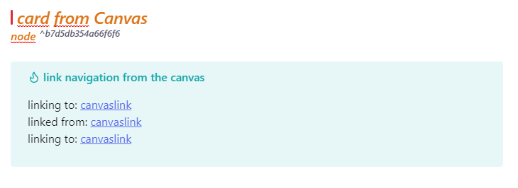
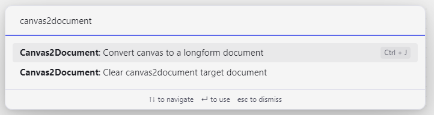
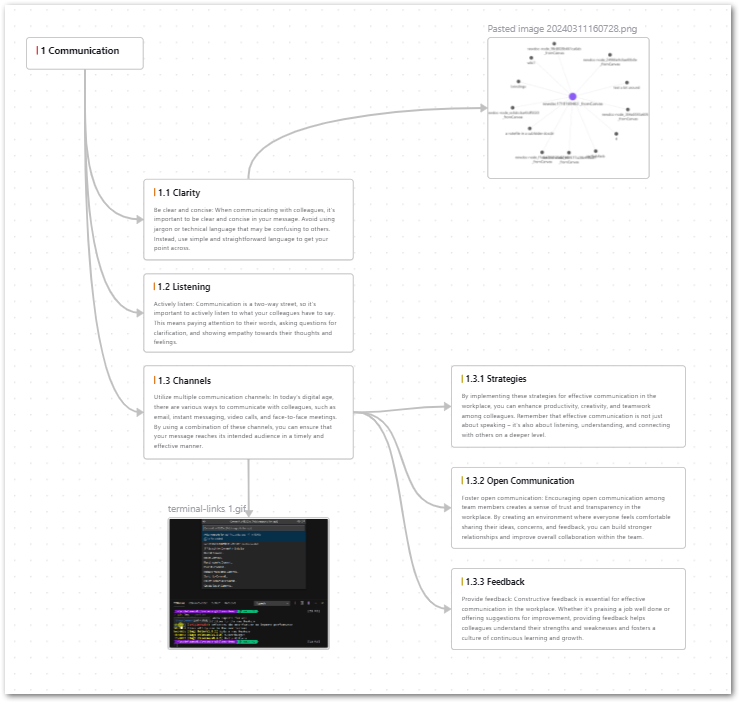
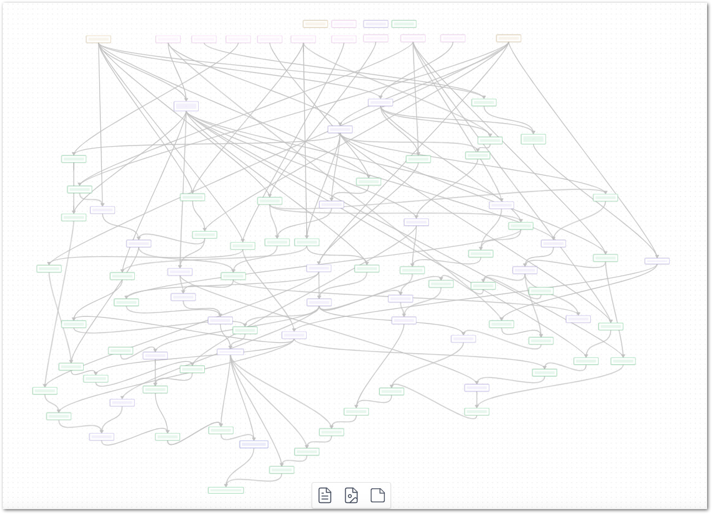

# Obsidian Canvas2Document

With Canvas2Document you can convert any canvas structure with all content, i.e. cards, notes, media (images, YouTube videos, PDF, websites) from the 2-dimensional representation into the linear structure of a document.
The plugin helps you to pour all the elements of a novel or a complex startup plan into one document and not to have to copy all the components individually.

The plugin reads [Obsidian's](https://obsidian.md/blog/json-canvas/) [JSON Canvas File Format](https://jsoncanvas.org/) and takes the elements from the canvas with their specific metadata. The metadata can then be used to navigate and arrange the elements in the document. The connections in the canvas are replicated via metadata headers containing corresponding links in the target document.

# Process and usage
The conversion process takes place in two steps:
1. First, a document is created (with command **Convert canvas to a longform document**) that integrates the elements of the canvas in manageable blocks (navigation headings are visible in the outline). The text content is not yet written into the document, but rather just embedded.
This allows the headings of cards and notes in the outline to be ignored, which in turn allows these blocks to be arranged or deleted at the canvas node level.
2. If the document is in the correct order and size, you can delete the node level navigation headings and the canvas metadata (with command **Clear canvas2document target document**) and you will receive your cleaned, converted canvas document containing all the real content level headings to continue editing the document normally.

# Handling of the generated documents
An adjustment or arrangement of the documents may be necessary because Obsidian Canvas is not necessarily used as a graph with a consistent hierarchical structure, as in the figure:

But an obsidian canvas can also look like this, making a simple hierarchical conversion from graph to document structure impossible:

# Roadmap
* Options for selecting types of elements to convert to Doc like "only notefiles", "no media"
* Better recognizing of (simple) hierarchical structures in the canvas
