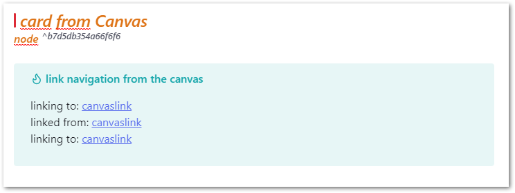

# Obsidian Canvas2Document

> [!IMPORTANT]  
> This addon is currently being evaluated by the Obsidian team and is not yet available in the addon store.
> 
> To install it anyway in this pre state:
> * just copy from the latest release (https://github.com/slnsys/obsidian-canvas2document/releases/tag/1.0.1) the attachments main.js and manifest.json to a dir in your vault's plugin dir
> * reload your community plugins and
> * enable the "Canvas2Document" plugin.

With Canvas2Document you can convert any canvas structure with all content, i.e. cards, notes, media (images, YouTube videos, PDF, websites) from the 2-dimensional representation into the linear structure of a document.
The plugin helps you to pour all the elements of a novel or a complex startup plan into one document and not have to copy all the components individually.

The plugin reads [Obsidian's](https://obsidian.md/blog/json-canvas/) [JSON Canvas File Format](https://jsoncanvas.org/) and takes the elements from the canvas with their specific metadata can then also be used to navigate and arrange the elements in the document.

The connections in the canvas are replicated via metadata headers with corresponding links in the target document.

# Handling of the generated documents
An adjustment or arrangement of the documents may be necessary because Obsidian Canvas is not necessarily used as a graph with a consistent hierarchical structure, as in the figure:

But an obsidian canvas can also look like this, making a simple hierarchical conversion from graph to document structure impossible:

# Usage
In the command palette call "Convert Canvas to a longform document"

# Roadmap
* Merging the embedded files in target doc
* Solutions for removing the navigational Metadata-Headers for the Elements in the target-Dokument.
* Options for selecting types of elements to convert to Doc like "only notefiles", "no media"
